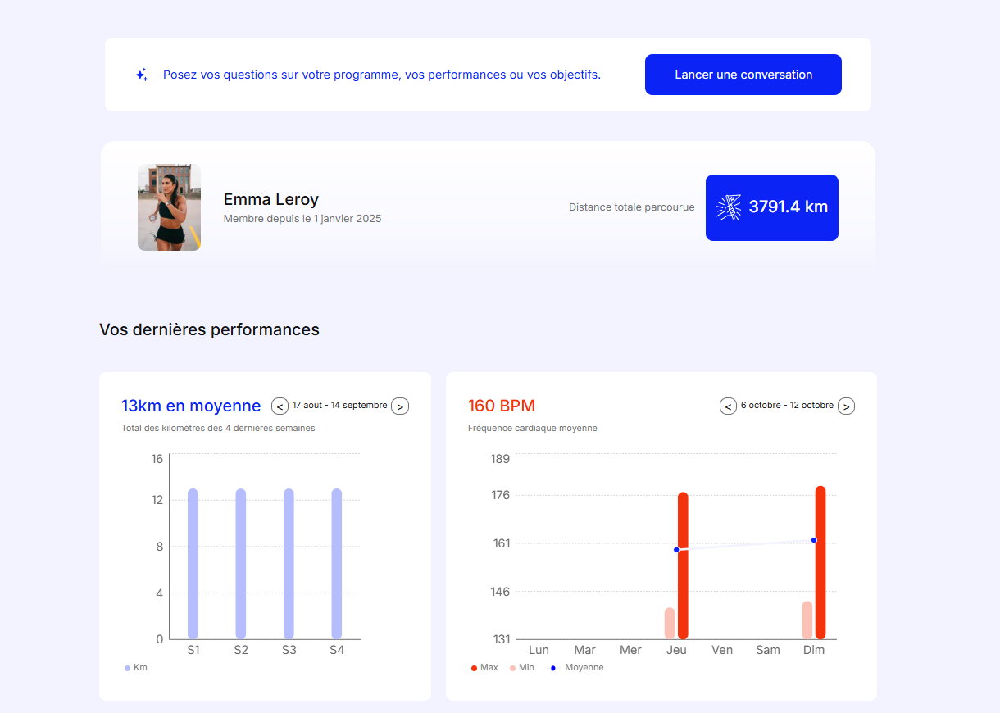
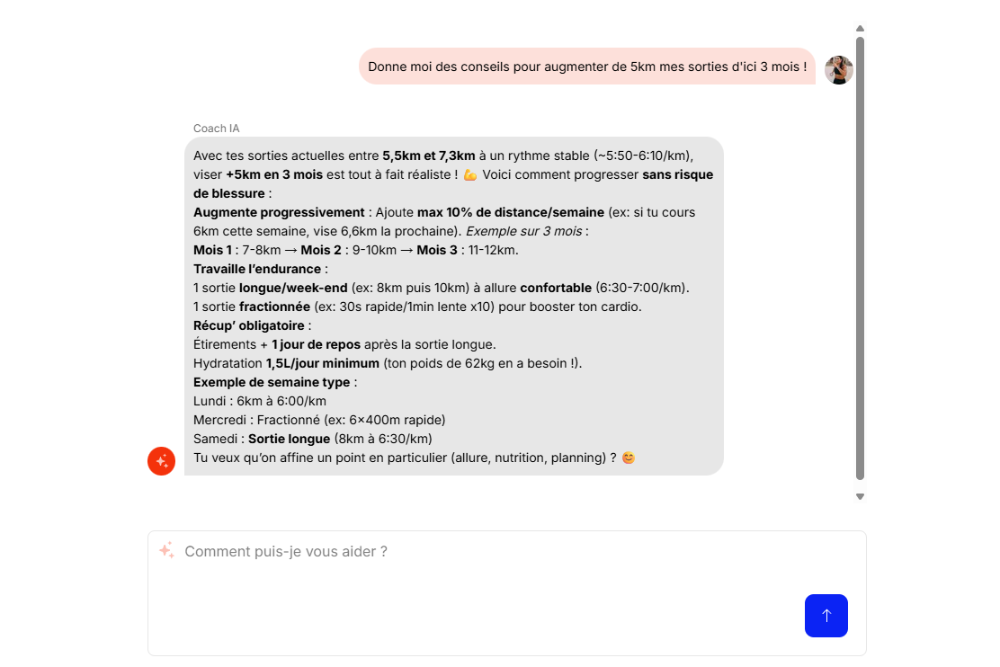

# Projet 6 OC – Dashboard IA Sportif / Project 6 OC – AI Sports Dashboard

[](#)
[](#)
[](#)
[](#)


## Preview

### Dashboard



### Chatbot



---

## 🇫🇷 Version française

Ceci est le dépôt GitHub d’un projet réalisé dans le cadre de ma formation **Développeur IA** avec OpenClassrooms.

L’objectif principal est de concevoir et développer une **application web interactive de type dashboard sportif** pour l'analyse de la performance athlétique et la gestion d'entraînement, en intégrant des services d'Intelligence Artificielle.

L'application est entièrement développée en **Full-Stack JavaScript/TypeScript** (Next.js) et se concentre sur les points suivants :

1.  **Visualisation de Données :** Affichage des métriques de performance via des graphiques **Recharts** pour faciliter la prise de décision.
2.  **Authentification Sécurisée :** Mise en place d'un système d'authentification robuste via **NextAuth.js**.
3.  **Assistance IA :** Intégration d'un **Chatbot Coach Sportif** propulsé par l'API de **Mistral AI** pour fournir des recommandations et des analyses contextuelles aux utilisateurs.

### Fonctionnalités Clés

- Authentification des utilisateurs (coachs/athlètes).
- Affichage des données de performance en temps réel (via API de simulation locale).
- Chatbot intelligent pour la planification et l'analyse des sessions d'entraînement.
- Tableaux de bord synthétiques pour le suivi des athlètes.

## Technologies utilisées

| Pile Technique                | Outil               | Rôle                                                                |
| :---------------------------- | :------------------ | :------------------------------------------------------------------ |
| **Frontend & Backend**        | **Next.js**         | Framework React Full-Stack (Routing, API Routes, SSR/SSG).          |
|                               | **React**           | Bibliothèque pour la construction de l'interface utilisateur.       |
|                               | **TypeScript (TS)** | Langage pour une codebase robuste et fortement typée.               |
| **Authentification**          | **NextAuth.js**     | Solution d'authentification complète pour les applications Next.js. |
| **Data & Graphiques**         | **Recharts**        | Bibliothèque React dédiée à la visualisation de données graphiques. |
| **Intelligence Artificielle** | **Mistral AI API**  | Intégration pour le moteur du chatbot de coaching sportif.          |

## Installation & utilisation

L'installation de l'application Next.js nécessite la configuration des variables d'environnement pour l'API et l'authentification.

1.  **Cloner le dépôt**

    ```bash
    git clone https://github.com/ifTrueReturnFalse/retraining-ai-sport-dashboard.git
    cd retraining-ai-sport-dashboard
    ```

2.  **Installer les dépendances Node.js**

    ```bash
    npm install # ou yarn install, ou pnpm install
    ```

3.  **Configuration des variables d'environnement**
    Créer un fichier `.env` à la racine du projet et configurer les variables :

    ```
    # 1. URL de l'API fournie par OC (simulant le serveur de données)
    API_URL=http://localhost:8000 # Mettre l'URL de l'API locale

    # 2. URL de l'application Next.js (utilisée par NextAuth pour les callbacks)
    NEXTAUTH_URL=http://localhost:3000

    # 3. Clé secrète pour chiffrer les jetons de session de NextAuth (Générez une chaîne aléatoire longue !)
    NEXTAUTH_SECRET=VOTRE_SECRET_TRES_LONG_ET_ALEATOIRE

    # 4. Clé d'accès pour l'API Mistral AI
    MISTRAL_API_KEY=VOTRE_CLE_MISTRAL_ICI
    ```

4.  **Lancer le serveur de développement**

    ```bash
    npm run dev
    ```

    L'application sera accessible sur `http://localhost:3000` (par défaut).

## Installation de l'API de simulation de données

Un API est fournie pour ce projet, et voici les étapes nécessaires pour son installation.

1. **Cloner le dépôt**

   ```bash
   git clone https://github.com/OpenClassrooms-Student-Center/P6JS.git
   cd P6JS
   ```

2. **Installer les dépendances Node.js**

   ```bash
   npm install # ou yarn install, ou pnpm install
   ```

3. **Corriger l'API**

   Le fichier package.json comporte une erreur (non corrigée lors de la rédaction de ce README) empêchant le lancement de l'API sur certains systèmes.
   Il faut remplacer cette ligne :

   ```bash
   "dev": "node_modules/.bin/nodemon app/index.js"
   ```

   Par celle-ci :

   ```bash
   "dev": "nodemon app/index.js"
   ```

   Vous pouvez retrouver l'issue que j'ai ouvert à ce sujet ici : [GitHub](https://github.com/OpenClassrooms-Student-Center/P6JS/issues/1)

4. **Lancer le serveur de développement**

   ```bash
   npm run dev
   ```

   L'API est disponible sur `http://localhost:8000/api` (par défaut).

## Identifiants de test

Voici les 3 identifiants de démonstration disponibles via l'API :

|Identifiant|Mot de passe|
|:----------|:-----------|
|sophiemartin|password123|
|marcdubois|password456|
|emmaleroy|password789|


---

## 🇬🇧 English version

This is the GitHub repository for a project carried out as part of my **AI Developer** training with OpenClassrooms.

The main objective is to design and develop an **interactive sports dashboard web application** for athletic performance analysis and training management, by integrating Artificial Intelligence services.

The application is entirely developed using a **Full-Stack JavaScript/TypeScript** approach (Next.js) and focuses on the following key aspects:

1.  **Data Visualization:** Displaying performance metrics via **Recharts** graphs to facilitate decision-making.
2.  **Secure Authentication:** Implementation of a robust authentication system using **NextAuth.js**.
3.  **AI Assistance:** Integration of a **Sports Coach Chatbot** powered by the **Mistral AI** API to provide users with recommendations and contextual analysis.

### Key Features

  - User authentication (coaches/athletes).
  - Display of real-time performance data (via local simulation API).
  - Intelligent chatbot for training session planning and analysis.
  - Synthetic dashboards for athlete monitoring.

## Technologies used

| Tech Stack | Tool | Role |
| :--- | :--- | :--- |
| **Frontend & Backend** | **Next.js** | Full-Stack React Framework (Routing, API Routes, SSR/SSG). |
| | **React** | Library for building the user interface. |
| | **TypeScript (TS)** | Language for a robust and strongly-typed codebase. |
| **Authentication** | **NextAuth.js** | Comprehensive authentication solution for Next.js applications. |
| **Data & Charts** | **Recharts** | Dedicated React library for graphical data visualization. |
| **Artificial Intelligence** | **Mistral AI API** | Integration for the sports coaching chatbot engine. |

## Installation & usage

The installation of the Next.js application requires configuring environment variables for the API and authentication.

1.  **Clone the repository**

    ```bash
    git clone https://github.com/ifTrueReturnFalse/retraining-ai-sport-dashboard.git
    cd retraining-ai-sport-dashboard
    ```

2.  **Install Node.js dependencies**

    ```bash
    npm install # or yarn install, or pnpm install
    ```

3.  **Environment Variables Configuration**
    Create a `.env` file at the root of the project and configure the variables:

    ```
    # 1. URL of the API provided by OC (simulating the data server)
    API_URL=http://localhost:8000 # Set the URL of the local API

    # 2. URL of the Next.js application (used by NextAuth for callbacks)
    NEXTAUTH_URL=http://localhost:3000

    # 3. Secret key to encrypt NextAuth session tokens (Generate a long random string!)
    NEXTAUTH_SECRET=YOUR_VERY_LONG_AND_RANDOM_SECRET

    # 4. Access key for the Mistral AI API
    MISTRAL_API_KEY=YOUR_MISTRAL_KEY_HERE
    ```

4.  **Run the development server**

    ```bash
    npm run dev
    ```

    The application will be accessible at `http://localhost:3000` (by default).

## Data Simulation API Installation

An API is provided for this project, and here are the necessary steps for its installation.

1.  **Clone the repository**

    ```bash
    git clone https://github.com/OpenClassrooms-Student-Center/P6JS.git
    cd P6JS
    ```

2.  **Install Node.js dependencies**

    ```bash
    npm install # or yarn install, or pnpm install
    ```

3.  **API Fix**

    The `package.json` file contains an error (uncorrected at the time of writing this README) preventing the API from launching on certain systems.
    You must replace this line:

    ```bash
    "dev": "node_modules/.bin/nodemon app/index.js"
    ```

    With this one:

    ```bash
    "dev": "nodemon app/index.js"
    ```

    You can find the issue I opened regarding this here: [GitHub](https://github.com/OpenClassrooms-Student-Center/P6JS/issues/1)

4.  **Run the development server**

    ```bash
    npm run dev
    ```

    The API is available at `http://localhost:8000/api` (by default).

## Test Credentials

Here are the 3 demonstration credentials available via the API:

| Username | Password |
| :--- | :--- |
| sophiemartin | password123 |
| marcdubois | password456 |
| emmaleroy | password789 |